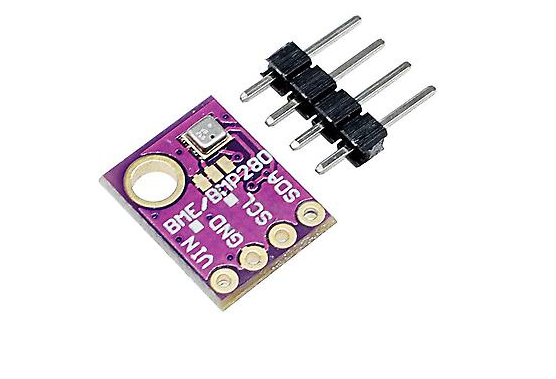
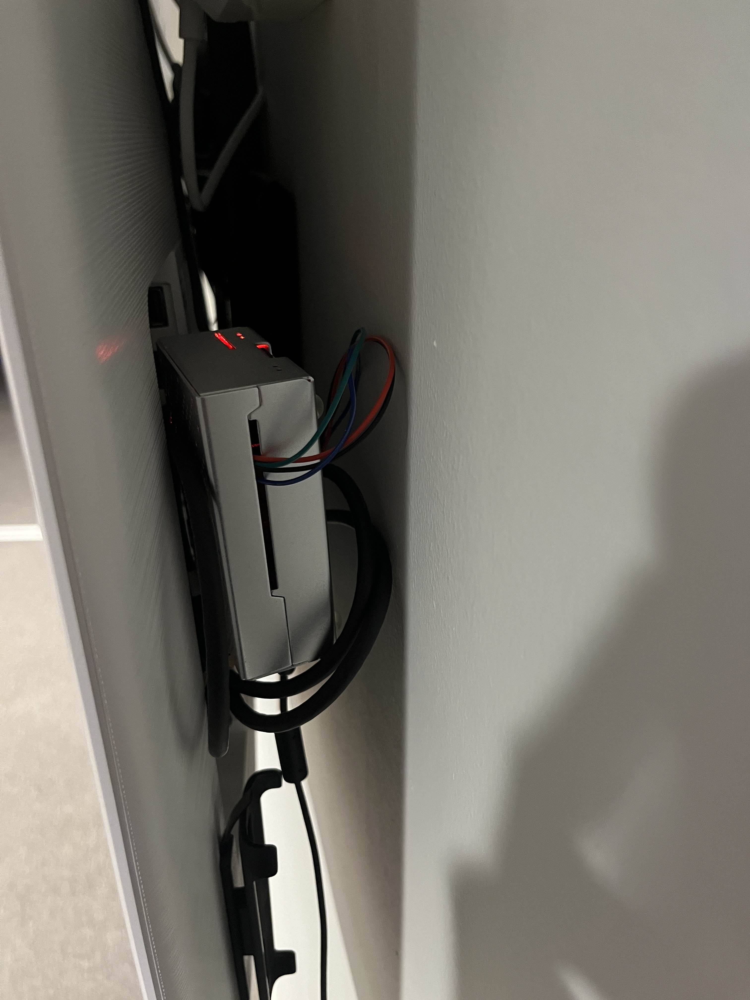

# Kiosk Project
## Description
This project is software that make a normal tv look like a kiosk. Like a moving poster.
Video of it 
## Used
All the services are deployed with helm into a kubernetes cluster and kubeseal is used for the secrets. 
The services is programmed in C# frontend in Angular(html,scss,typescript) database is mysql. The build and deply scripts are powershell.
## How it works 
All the services and the frontend are running in a kubernetes cluster on a hp computer 

On the tv a raspberry pi is connected by hdmi with a attached BME280 sensor. The raspberry shows the frontend.

## Services 
Admin - Admin Backend and frontend is used to controll what will be showing and for how long. Values stored in redis that can be used by the other services.

Barometer - Barometersensor is whats running on the raspberry actevly collecting tempratur and air moist in the room. barometer backend is used by the front end to collect the data from the Db

Buildversion - is used by the build script to add versioning. 

Calender - Gets data from google calender and store it in a Db. includes endpoint so frontend can get it.

Info - can uploud a txt file and it will be stored as a html div. include endpoint for frontend. A ester egg with it is that you can add html into the txt file to format.

kiosk - Angular frontend

Smhi - gets and stores weather predictions. 

SogetiNews - Gets company public anounsments from website and stores in db to later be collected by frontend. 
